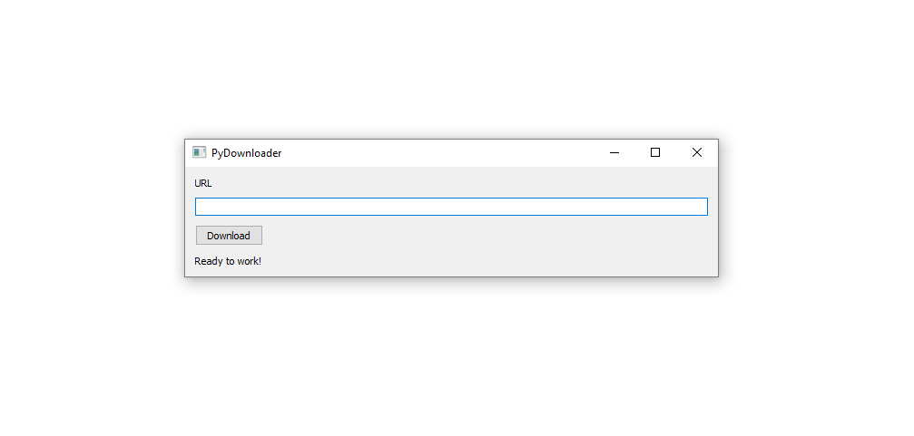

# PyDownloader v.0.0.1

## A GUI client for the youtube-dl module

[Check out YOUTUBE-DL project](https://github.com/rg3/youtube-dl)

This is a simple Qt client for those who do not want to use the terminal/cmd and/or are not familiar with python. The idea is to simplify into a GUI.

### Current Status
* **Requires Python 3.4+ as well as youtube-dl and PyQt5 modules**
* **Running as a script, unsuccessful attempts at creating client. (Crashes during download only)**
* **It downloads files to the same directory as the script (Pydownloader.py)**
* **It downloads at the best settings by default**

### TODO
* Choose path to download
* Create client application (an Executable)
* Enable Options (format, file name etc)
* Preview thumbnail
* Search in App
